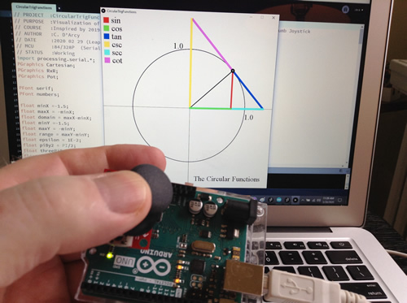

# RSGC ACES: The Circular Functions

## Background
An interest in applied mathematics led me to imagine the ACES program almost two decades ago.  With our program well-established in 2020, I remain fascinated by manners in which our prototypes and projects demonstrate the principles (and wonders) of mathematics.
Curriculum concepts leading in to, and out of, the March Break, in both our ICS3U and ICS4U courses (Serial Communication, Processing, rotational mechanics and the DDP to be precise) inspired me to create a simple hardware and software system to demonstrate an important interpretation in mathematics that I'm not the extent to which it reveals itself the standard math curriculum, 

### The Circular Functions

Now, ACES know them well as the suite of six trigonometric functions, and their dividends in determining the angles and side lengths of triangles. Indeed, the Greek etymology of the word itself  (<em>tri</em>-3, <em>gon</em>-corner angle, <em>metric</em>-measure) speaks directly to this application. 
However, what may possibly elude students who graph these functions on the Cartesian Plane is the intimate relationship all six  share as a point travels the circumference of a circle.  Analysis of a point traveling on a circular path is common in Physics and Mechanical Engineering and, as such, linking this behaviour to the trigonometric functions is indispensable.

For the hardware component, I simply inserted a [ http://darcy.rsgc.on.ca/ACES/images/ThumbJoystick.jpg ]Thumb Joystick into an Arduino, read and scaled the dual potentiometer readings and placed the value on the Serial Output stream.

On the software side, I wrote a Processing sketch that places a unit circle against a minimal Cartesian Plane before reading the Joystick data pair from the Serial stream in order to render the six related line segments, one for each circular (trig) function.
In this context, the value of the respective function is the length of a line segment between to points determined exclusively by the angle formed by the (black) radius and positive horizontal axis.  
  