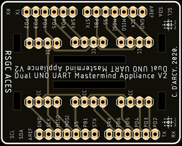

# SerialMastermind  []

## Beginnings
A comprehensive project, based loosely on the *Mastermind* board game from the 1970s, was conceived and developed in the Fall of 2019 to support the ICS3U introduction to Serial Communication.
Tutorials and more project information are available on the [ACES Serial Mastermind homepage](http://darcy.rsgc.on.ca/ACES/Projects/SerialMastermind/index.html).

## Components

### Arduino UNO
Each of two players provides their own Arduino UNO and cable, capable of displaying content to his Serial Monitor.

### PCB (Appliance)
A custom PCB appliance game board was designed and manufactured by JLCLabs. The appliance is inserted into each of two players' Arduino UNOs. Three RGB LEDs (ABRA) are used in place of pegs
to yield 27 different secret code combinations. Each player's secret code is obscured from his opponent's view by a 3D printed cover developed by J. Dolgin (ACES '20). This area will be referred to as the 'dugout'.

### Class: SerialMastermind
The Arduino C class (SerialMastermind.h and SerialMastermind.cpp) was developed to support local hardware serial communications to the player's Serial Monitor through pins 0 and 1 (Rx/Tx) and 
software serial communication to the opponent's UNO through pins 7 and 8 (Rx/Tx).  The class handles the suggested code and response exchanges as well as monotiring for the win, 
which it signals by lighting the onboard green LED when the game is won.

## The Game
The game client (<code>SerialMastermind.ino</code>) is the same for both players. Once the UNOs are conjoined by the SerialMastermind Appliance, each player opens and uploads the client. 
On opening the Serial Monitor, each player must enter his three character secret code which will appear in his dugout. 
Each players' own secret code consisting of a sequence of three colours displayed on each of the three RGB LEDs. The code is visible to the player but shrouded from sight by the opponent.

